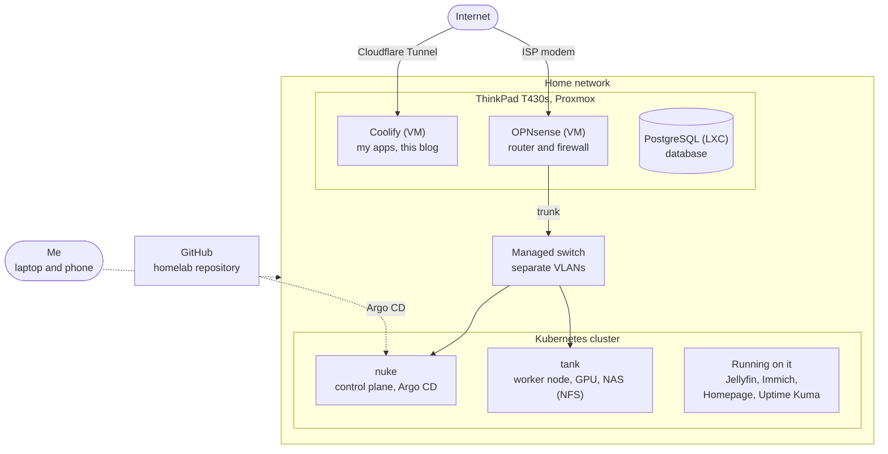

```mermaid
flowchart TB
  internet(["Internet"])
  me(["Me<br/>laptop and phone"])
  github["GitHub<br/>homelab repository"]

  subgraph home["Home network"]
    subgraph t430s["ThinkPad T430s, Proxmox"]
      direction LR
      coolify["Coolify (VM)<br/>my apps, this blog"]
      opnsense["OPNsense (VM)<br/>router and firewall"]
      postgres[("PostgreSQL (LXC)<br/>database")]
    end

    switch["Managed switch<br/>separate VLANs"]

    subgraph k8s["Kubernetes cluster"]
      direction LR
      nuke["nuke<br/>control plane, Argo CD"]
      tank["tank<br/>worker node, GPU, NAS (NFS)"]
      apps["Running on it<br/>Jellyfin, Immich,<br/>Homepage, Uptime Kuma"]
    end
  end

  internet -->|Cloudflare Tunnel| coolify
  internet -->|ISP modem| opnsense
  opnsense -->|trunk| switch
  switch --> nuke
  switch --> tank
  me -.->|Tailscale| home
  github -.->|Argo CD| nuke
```
